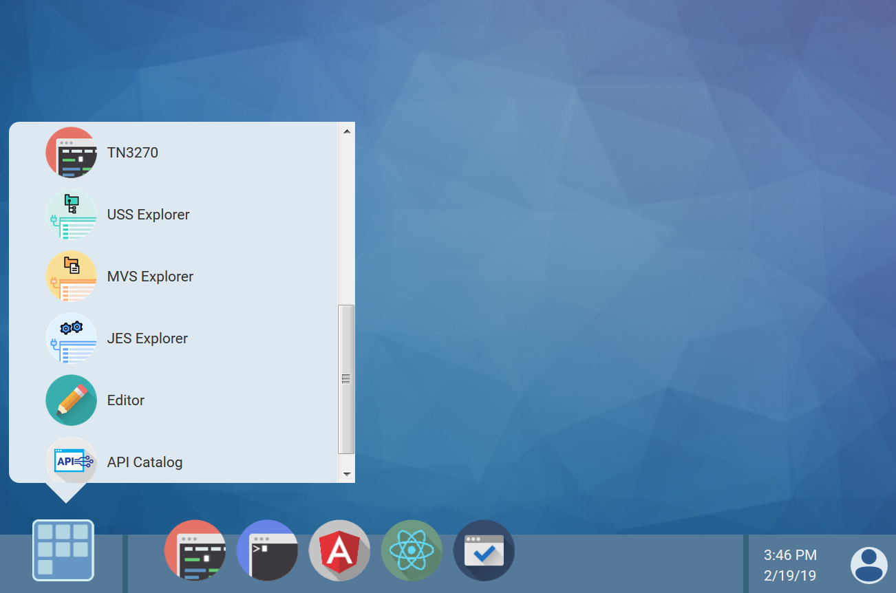
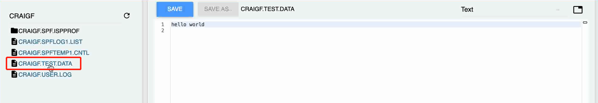
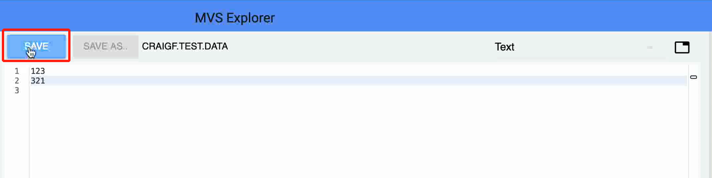

# Scenario 1: Getting started with Zowe

- [Scenario 1: Getting started with Zowe](#scenario-1-getting-started-with-zowe)
	1. [Overview](#overview)
	2. [Logging in to the Zowe Desktop](#logging-in-to-the-zowe-desktop)
	3. [Editing a data set](#editing-a-data-set)
	4. [Querying the JES job and viewing its related status in JES explorer](#querying-the-jes-job-and-viewing-its-related-status-in-jes-explorer)
	5. [Using TN3270 in Zowe desktop to view the job](#using-tn3270-in-zowe-desktop-to-view-the-job)
	6. [Use the Zowe CLI to create data sets and upload to mainframe](#use-the-zowe-cli-to-create-data-sets-and-upload-to-mainframe)
	7. [Using the MVS Explorer to view the data sets](#using-the-mvs-explorer-to-view-the-data-sets)
	8. [Next Steps](#next-steps)
	- [Try the Extending Zowe scenario](#try-the-extending-zowe-scenario)
	- [Go deeper with Zowe](#go-deeper-with-zowe)

## Overview

Zowe offers modern interfaces that enables you to interact with z/OS in a way that is similar to what you experience on cloud platforms today. Like Mac or Windows, Zowe comes with a set of APIs and OS capabilities that applications build on and includes some applications out of the box.

This scenario walks you through the Zowe interfaces including the Zowe Desktop and Zowe CLI through several simple tasks to help you get familiar with Zowe.
- If you are new to Zowe, start with this scenario to explore the base Zowe features and functions.
- If you are familiar with Zowe, you can skip this scenario and directly go to **Scenario 2** which guides you to extend Zowe by creating your own APIs and applications.

This scenario guides you through the steps in roughly 30 minutes. By the end of the session, you'll know how to:
- Log in to the Zowe Desktop
- Use the MVS Explorer to submit data sets that contain JCL to Job Entry Subsystem (JES)
- Use JES explorer to query jobs with filters, and view the related status
- Use TN3270 in the Zowe Desktop to view the job and (purge the job)
- Use the Zowe CLI to create data sets and upload to mainframe
- Use the MVS Explorer to view the data sets

<!--If you haven't started the scenario, complete the following steps:
1. Double-click Z Trial Wizard.exe on the desktop.
1. In the Z Trial Program window, select the scenario that you want and click **Explore scenario**.
1. In the pop-up window, click **Start scenario**.-->

As an introductory scenario, no previous knowledge of Zowe is needed. Please wait a moment while your development environment loads (this takes a minute or so). When it loads, get started by logging in to the Zowe Desktop.

## Logging in to the Zowe Desktop
Access and navigate the Zowe Desktop to view the Zowe applications.

### Procedure
1.	In the taskbar, click the icon of Firefox to start the browser.
1.	Enter the following URL in the address bar to access the login page:
`https://myhost:httpsPort/ZLUX/plugins/org.zowe.zlux.bootstrap/web/index.html` (URL to be replaced with an accessible one)
1.	On the login page of the Zowe Desktop, enter your mainframe credentials.
    - **Username**: TBD
    - **Password**: TBD
    <!--Should we prevision this for users? Any risk on providing the credentials to users?-->
    
1.	Press Enter.

### Results
Upon authentication of your user name and password, the desktop opens.

Several applications are pinned to the task bar. Click the Start menu and you will see a list of applications that are installed by default. You can pin other applications to the task bar by right-clicking the on the application icon and selecting **Pin to taskbar**.

### What to do next
The next step is to use the MVS Explorer to make changes to data sets.

## Editing a data set
Use the MVS Explorer to edit a data set and save the changes.

The MVS Explorer view allows you to browse the MVS file system by creating filters against data set names.

### Procedure
1. Click the Start menu on Zowe Desktop.
2. Locate the **MVS Explorer** application and click to open it. You can also right-click and select **Open** from the menu. The file opens in the editor.
3. Locate and click the data set member `CRAIG.TEST.DATA`. <!--The data set name need to be updated later to match what's actually on zTrial image.-->
    
4. Edit the data set.
5. Click **SAVE** to save your edits.
    

### Results

Your edits are saved!

### What to do next

Next, you'll use the JES Explorer to query JES jobs with filters and view the related status.

## Querying the JES job and viewing its related status in JES explorer

### About this task
You will use Job Entry Subsystem (JES) explorer to query the JES job with filters and view its related status.

### Procedure
1. In the bottom application draw of Zowe Desktop, you can see several explorer server icons. Click the JES Explorer icon, the JES jobs are displayed.
1. .... (query JES jobs filters, and view the related steps, files, and status.)
1. .......

## What to do next
Next, you'll use the TN3270 application plug-in in Zowe Desktop to view the job that you created.

## Using TN3270 in Zowe desktop to view the job

### About this task
You'll use the TN3270 application plug-in to view the job that you just created. This TN3270 plug-in provides a 3270 connection to the mainframe on which the Zowe Application Server runs.

### Procedures
1. ...
1. ...
1. ...

### What to do next

## Use the Zowe CLI to create data sets and upload to mainframe

### About this task

Zowe Command Line Interface (Zowe CLI) is a command-line interface that allows users to interact with z/OS from a variety of other platforms, such as cloud or distributed systems, to submit jobs, issue TSO and z/OS console commands, integrate z/OS actions into scripts, and produce responses as JSON documents. With this extensible and scriptable interface, you can tie in mainframes to distributed DevOps pipelines and build in automation.

You'll use Zowe CLI to create data sets and upload to mainframe...

### Procedures

Note: Zowe CLI contains a help system that is embedded directly into the command-line interface. When you want help with Zowe CLI, you can issue the following help command that provides you with information about the product, syntax, and usage:

`zowe - - help`

1. xxx
1. xxx
1. xxx

### What to do next

## Using the MVS Explorer to view the data sets

### About this task
You'll use the MVS Explorer to view the data sets.

### Procedures
1. In the bottom application draw of Zowe Desktop, you can see several explorer server icons. Click the MVS Explorer icon, the MVS explorer is displayed.
1. Use the high-level qualifier filter to browse the MVS file system (data set and members) and...
1. ...

### What to do next
Congratulations! You've successfully got hands-on experience with Zowe! ......

## Next Steps
Ready to become a Zowe extender? Try to explore how you could extend Zowe to create your own APIs and applications.

## Try the Extending Zowe scenario
...... link to the next scenario to be pasted here

## Go deeper with Zowe
Enjoyed this scenario? Now that you're familiar with each Zowe component, why not try to learn more about the product information and the value it delivers. For more information, see Zowe on Open Mainframe Project (https://www.openmainframeproject.org/projects/zowe).
