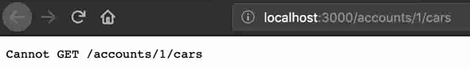
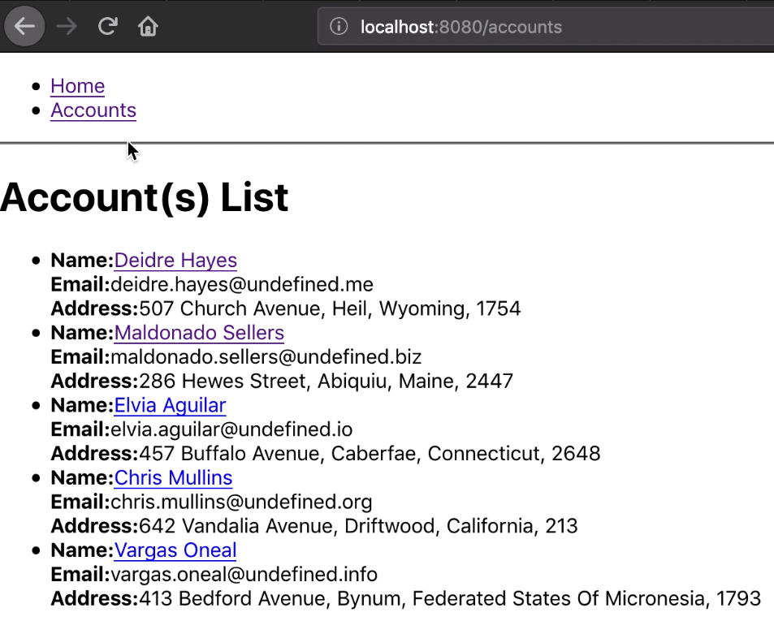

# Scenario 2: Extending Zowe

1. [Overview](#overview)
2. [Extend the Zowe API](#step-1-extend-the-zowe-api)
   - [**Procedure**](#procedure)
   - [**Next step**](#next-step)
3. [Extending Zowe Application Framework](#step-2-extending-zowe-application-framework)
    - [**Procedure**](#procedure-1)
    - [**Result**](#result)
    - [**Next step**](#next-step-1)
4. [Extending Zowe CLI](#step-3-extending-zowe-cli)
    - [**Procedure**](#procedure-1)
    - [**Result**](#results)
5. [Next Steps](#next-steps)
6. [Go deeper with Zowe](#go-deeper-with-zowe)
## Overview

In this scenario, you will learn how to extend Zowe to add your own API or application. This scenario guides you through the steps in roughly 30 minutes. By the end of the session, you'll know how to:

- Extend the API by adding a REST API to the API Mediation Layer
- Extend Zowe Web UI by creating and deploying an application plug-in on Zowe Desktop
- Extend Zowe CLI by creating a Zowe CLI plug-in to access the API

No previous knowledge of Zowe is needed but some knowledge of API and command line will be helpful. Please wait a moment while your development environment loads (this takes a minute or so). When it loads, get started by extending the API.

## Step 1: Extending the Zowe API

In this step, you will add the missing code to expose an API in API Medidation Layer and then access your API service endpoints to ensure that it works.

The sample API used in this step is a Node.js API for finding cars and accounts for a dealership. This API which has some missing features will be running in the API Catalog of the API Mediation Layer. You will view the current API, add the missing code for the feature, redeploy it and then test that the API service endpoint works.

<!--Requirements on the client system: VSCode, npm-->

### **Procedure**

1. Visit the Swagger doc.

    >**Questions:** Is it the doc in the API Catalog? How can users access that, by logging in to the API Catalog and click the API Catalog app? Will this Node.js API be prebuilt in zTrial so users can access? Which Swagger doc should users open?

1. Open Firefox and enter the following URL in the address field.  
    >**Questions:** What's the purpose of doing this? To test if the endpoint works?

    ```http://localhost:3000/accounts/1/cars```

    The following error message is displayed, which indicates that the API edpoint is not working.

    

1. Open Visual Studio Code from the desktop.
    >**Questions:** How can users open VSCode in the zTrial Windows image? Think that will need to be preinstalled. We need to clarify the path to access VSCode in zTrial here.

1. Open the terminal by using the **View** > **Terminal** menu command. The terminal is opened at the bottom of the editor window.
1. Enter `npm start`.
1. Enter `npm test`. You will see that one test fails.

    

    This is because there are missing code in the configuration file. Next, let's locate the file to add the missing code.

1. Open the Explorer tab of VSCode and then click **SAMPLE-NODE-API** > **server** > **routes** > **accountsCars.route.js**. The contents of the **accountsCars.route.js** file is displayed.

    

    You will see that the code for a feature is missing in this file.

    

1. Insert the following code to the file and press `Ctrl+S` to save the changes.
    >**Questions:** Where should users find the missing code? Currently we just put it here so users can copy and paste. This might also be the quickest way to get the code.

    ```
    router.route('/cars')
    .get(accountsCarsController.getAll);

    router.route('/cars/:_id')
    .get(accountsCarsController.get);
    ```
    

1. Redeploy the API.
    >**Questions:** How to do this? Need more clarification here.

1. In the TERMINAL panel, enter the `npm start` command.
1. Open Firefox again and enter the following URL in the address field.

    ```http://localhost:3000/accounts/1/cars```

    You should get the following response, which indicates that you can access the API endpoints.

    

    >**Questions:** Should users also go to API Catalog to verify that it's working?

### **Next step**
In the next step, a sample application that uses the sample API is deployed on the Zowe Desktop. Similar to what you did in this step, you will add some missing features to make that application work to get experience with Zowe Web UI development.

## Step 2: Extending Zowe Application Framework

In this step, you will combine some provided code snippets with the skeleton code to build a sample React application that works on the Zowe Desktop.

<!--Requirements on the client system: We need to -->

### **Procedure**

1. Locate and test the React application.
    1. Start Firefox.
    1. In the address field, enter the following URL to access the Zowe Desktop.
        ```https://10.149.60.146:8544/ZLUX/plugins/org.zowe.zlux.bootstrap/web/index.html```
    1. Enter the following username and password.
        - User name: TSTRADM
        - Password: TSTRADM

         The Zowe Desktop opens.
    1. Click the Start menu and scroll down to locate the React application. Right-click on the React application and select **Pin to taskbar** for later use.
    1. Click to open the React app from the taskbar.  
        You can click through the links and you will see that some function is not working. This is because there are missing values in the configuration file of this application.

        

        Next, let's test this application using the VSCode terminal.
    1. Open the VSCode terminal.
    1. Click **File** > **Open Folder** to open the `sample-trial-react-app` folder.
        >**Questions:** Should we provision this for users instead of letting them locate the folder by themselves? If yes, we might need to consolidate a list of folders and upload to the Windows image. Also need to prepare the files to have missing code beforehand.
    1. Enter the `npm test` command. You will see that the test fails.
2. Add the missing code.
    1. In VSCode Explorer, click **src** > **Cars.js**. This file contains the missing values.

        

        You will see that the code for a feature is missing in this file.

        >**Comment:** Need to determine the file and the missing code for users to add.

        Next, let's fetch the missing code to be added.

        >**Comment/questions:** Can we just document the missing code for users to copy/paste instead of guiding them to use MVS to retrieve the missing code? Users in this scenario should already be familiar with MVS though.

    1. Insert the following code to the configuration file and press `Ctrl+S` to save the changes.

        >**Comment:** Add the code here and add a screenshot to show the correct location.

3. Redeploy the changes.
     >**Questions:** Need more details here about how to redeploy.

4.  Verify that the React application works correctly now.
    1. From the taskbar, open the React application.
    1. Verify that the previously failed page works correctly now.

         >**Comments/Notes:**  Need to design the story and error details here and in previous step. For example, a certain account cannot be retrieved?

    1. Open VSCode terminal and enter `npm test` to check the result.

### Result
Congratulations! You added the missing values, deployed the changes, and verified that the application works correctly.

### **Next step**

In the next step, You will work on a Zowe CLI plug-in based on the same Node.js API.

## Step 3: Extending Zowe CLI

You will extend an existing Zowe CLI plug-in by introducing the Node.js programmatic API in scenario 1.

<!--Requirements on the client system: -->

**Procedure**
1. Open Visual Studio Code from the desktop.
1. From the **Menu Bar**, open the terminal by using the **View** > **Terminal** menu command.  
    Below the editor region, the terminal panel is started in the current working directory, **ZTRIAL-CLI**.
1. Run the following CLI command to check whether the data set _average-horse-power_ can be accessed.  
    `zowe ztrial-plugin cars average-horse-power`  
    You'll see that a command syntax error is prompted.
1. Enter `npm test` to execute the tests. You will get the following output, which says that one test fails.  
      
    This is because there are missing codes in the configuration file. Next, let's locate the file to add the missing codes.
1. From the Workspace **ZTRIAL-CLI**, click **src** > **api** > **Car.ts (temp name)** to open the **Car.ts** typescript file. The contents of the **Car.ts** is displayed in the editor region.   
    You will see that the code for a feature is missing in this file.
1. Download the missing code and insert to the **Car.ts** file.
    1. To get the missing code snippet, use the Zowe CLI plugin to download. In the terminal panel, enter the following command:  
         >**To be done:the command to be added`  
    
        The dataset is successfully downloaded.

    2. View the content of the dataset and find the missing code block, and then insert it into the **Car.ts** file and press `Ctrl+S` to save the changes.
1. Redeploy the API.
    1. In the terminal panel, enter `npm run build` to build a new package.
    >**To be done:** more details.
    2. Enter `zowe plugins install ./` to install the plug-in.
    >**To be done:** the name of the plug-in.  
1. Verify that this API works correctly now.
    1. In the terminal panel, run the following CLI command to check whether the data set _average-horse-power_ can be accessed:  
    `zowe ztrial-plugin cars average-horse-power-for-account 4`  
    You'll see an error-free result with no command syntax error.
    2. Enter `npm test` to execute the tests. You will see the following all-pass output.  
        >**To be done:** more details and screenshots to be added.

**Results**  
    Congratulations! You added the missing feature of the API, redeployed the API, and verified that the CLI plug-in works correctly with this API.

# Next Steps
Thanks for your time in exploring the Zowe scenarios!
# Go deeper with Zowe
Zowe is an open source project that is created to host technologies that benefit the Z platform from all members of the Z community, including Integrated Software Vendors, System Integrators, and z/OS consumers.

Zowe, like Mac or Windows, comes with a set of APIs and OS capabilities that applications build on and also includes some applications out of the box.

If you have any interest, visit Zowe (https://zowe.github.io) on Open Mainframe Project to learn more about the capabilities of Zowe and the value it delivers.
