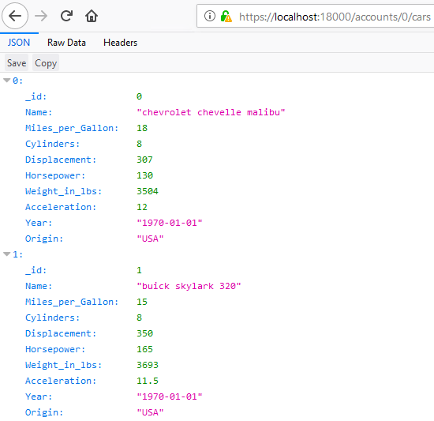
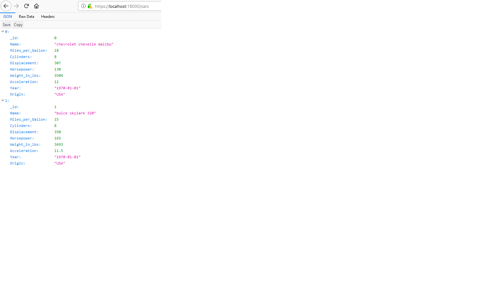
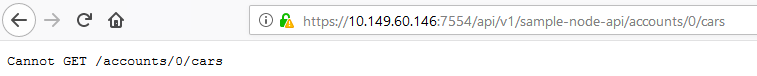

# Scenario 2: Extending Zowe

1. [Overview](#overview)
2. [Extend the Zowe API](#step-1-extend-the-zowe-api)
3. [Extending Zowe Application Framework](#step-2-extending-zowe-application-framework)
4. [Extending Zowe CLI](#step-3-extending-zowe-cli)
5. [Next Steps](#next-steps)
6. [Go deeper with Zowe](#go-deeper-with-zowe)

## Overview

In this scenario, you will learn how to extend Zowe by adding new features in the sample Zowe API and applications and deploying the change. This scenario guides you through the steps in roughly 30 minutes. By the end of the session, you'll know how to:

- Extend the API by adding a new feature to a REST API in the API Mediation Layer
- Extend Zowe Application Framework by adding a new feature to an application plug-in on the Zowe Desktop
- Extend Zowe CLI by creating a Zowe CLI plug-in to access the API

No previous knowledge of Zowe is needed but some knowledge of API and command line will be helpful. Please wait a moment while your development environment loads (this takes a minute or so). When it loads, get started by extending the API.

## Step 1: Extending the Zowe API

In this step, you will add a new feature in an API in the Zowe API Medidation Layer and then access your API service endpoints to ensure that it works.

The sample API used in this step is a Node.js API for finding cars and accounts for a dealership. This API will be running in the API Catalog of the API Mediation Layer. You will view the current API, add the code for a new feature, redeploy the API, and then test that the API service endpoint works.

### Procedure

1. Develop custom API.
    1. Open the sample API project in Visual Studio Code (VSCode).
       1. Click on the Windows Explorer icon in the taskbar to open the Windows Explorer, and go to this folder C:\Users\Administrator\Documents\
       2. Right click the folder named sample-node-api and select **Open with Code**.
           
    1. Run the sample API project in the VSCode terminal.
       1. In VSCode, from the Menu Bar, open the terminal by using the View > Terminal menu command.
           

          Below the editor region, the terminal panel is started in the current working directory.
       2. In the terminal panel, enter `npm install`.

           
       3. Enter `npm start`.

          
    1. Access local urls.
       1. From the Taskbar in the Desktop, click the Firefox icon to open Firefox.
       2. Enter the following URL in the address field to get the information about all accounts.
       `http://localhost:18000/accounts`
       The following error message is displayed, which indicates that the API edpoint is not working.
       
    1. Enter `npm test` in the VSCode terminal. You will see that one test fails.

        

        This is because there are missing code in the configuration file. Next, let's locate the file to add the missing code.

    1. Add the missing feature into the sample API node project.
       1. Open the Explorer tab of VSCode and then click **SAMPLE-NODE-API** > **server** > **routes** > **accountsCars.route.js**. The contents of the **accountsCars.route.js** file is displayed.
            

            You will see that the code for a feature is missing in this file.

            

        2. Next, fetch the missing code and add it to this file.
           Insert the following code to the file and press `Ctrl+S` to save the changes.

           ```
           router.route('/cars')
           .get(accountsCarsController.getAll);

           router.route('/cars/:_id')
           .get(accountsCarsController.get);
           ```
            

       3. Restart the project in the terminal.
          1. Press `ctrl+c` in the terminal to stop the project.
          2. Use `npm start` to restart the project.

     1. Access the newly added path in the Firefox browser.

        Open Firefox and enter the following URL in the address field to get the information about all accounts.
           `http://localhost:18000/accounts`

          

        Similarly, you can enter the URL `http://localhost:18000/cars` to get the infomation about all cars and the URL `http://localhost:18000/car/1` to get the information about the single car details.  

         

         

   Now you succefully add the missing feature locally. Next, you'll redeploy this API and see the changes on the Zowe server.

1. Redeploy this API and see the changes on zowe server.
    1. Open the Firefox browser, access the same API running on the zowe server.

       Open Firefox and enter the following URL in the address field to get the information about all cars.
          `https://10.149.60.146:7554/api/v1/sample-node-api/cars`

          

          You could see that the new paths you added locally are not deployed to the Zowe server yet.

    2. Redeploy the updated sample API node files to the Zowe server.

       1. From the Taskbar in the Desktop, click the PowerShell icon to open PowerShell.
       2. Enter the following command to upload the updated sample files to the Zowe server.
         `scp -r server TSTRADM@10.149.60.146::/u/zowe/ibmuser/1.0.1/sample-node-api/server`
       3. Enter password: TSTRADM.
    3. Restart the sample.
       ```
       ssh TSTRADM@10.149.60.146
       >Enter Password - TSTRADM
       cd /u/zowe/ibmuser/1.0.1/scripts
       ./zowe-stop.sh
       ./zowe-start.sh
       ```
        >**TBD:** To be replaced. Acoording to Vijay's advice, we will not restart the whole Zowe server. Nakul and Craig will investigate if we could write a piece of script to implement a clickable window application.

     1. Access the newly deployed API again in Firefox.

         Enter the following URL in the address field:
         `https://10.149.60.146:7554/api/v1/sample-node-api/cars`
          >**TBD:** to add a screeshot.

          It works now and you can see the information about all cars. You can aslo try this URL `https://10.149.60.146:7554/api/v1/sample-node-api/cars/1` to get the information about the single car details.

### Results
You successfully added the missing feature to the sample node API and redeployed to the Zowe server.

### Next step
In the next step, a sample application that uses this sample API is deployed on the Zowe Desktop. Similar to what you did in this step, you will add some missing features to make that application work to get experience with Zowe Web UI development.

## Step 2: Extending Zowe Application Framework

In this step, you will add some provided code snippets with the existing code to build a Trial Sample application that works fully on the Zowe Desktop.

### Procedure
1. Build and test the Trial Sample application in Zowe Desktop.
    1. Open the sample Zowe Application Framework project in VSCode.
    1. Click on the Windows Explorer icon in the taskbar to open the Windows Explorer, and go to this folder C:\Users\Administrator\Documents\
    2. Right click the folder named zlux and select **Open with Code**.
       
    1. Run the sample project in the VSCode terminal and upload the missing files to the sample application on the Zowe server.
    1. In VSCode, from the Menu Bar, open the terminal by using the View > Terminal menu command.
    
          
       
        Below the editor region, the terminal panel is started in the current working directory.
       
    1. Change the current working directory to _webClient_ by issuing the following command in the terminal panel:
       ```
       cd webClient
       ```
    1. Enter `npm install`.

            
    1. Enter the following command to set the environment variable:
       ```
       export MVD_DESKTOP_DIR=C:\\Users\\Administrator\\Documents\\zowe-trial-scenario-2\\part-02-ui\\zlux\\zlux-app-manager\\virtual-desktop
      ```
    1. Enter `npm run build` to run the build.
       A folder named _web_ is created in the root directory _sample-trial-app_.
    1. Transfer the files from the _web_ folder to the Trial Application folder on the Zowe server.
      1. Enter the following command:
         ```
         scp -P 2022 -r ../web tstradm@10.149.60.146:/zaas1/zowe/1.0.0/sample-trial-app
         ```
      2. Enter the password. The password is _tstradm_.
         The files _icon.png_, _mian.js_, and _main.js.map_ are securely copied to the folder _sample-trial-app_ on the Zowe server.
1. Open and test the Trial Sample application in the Zowe desktop.
    1. Start Firefox and enter the following URL to access the Zowe Desktop in the address field.
        ```https://10.149.60.146:8544/ZLUX/plugins/org.zowe.zlux.bootstrap/web/index.html```
    1. Enter the following username and password to log in.
       - User name: TSTRADM
       - Password: TSTRADM

       The Zowe Desktop opens.
    1. In the Zowe desktop, click the Start menu and locate the _Trial Sample_ application. Right-click on the _Trial Sample_ application and select **Pin to taskbar** for later use.
    1. Click to open the _Trial Sample_ application from the taskbar.

       In this application, click **Accounts** and you could see that the values of the **Name** column are missing. This because of some missing values in the configuration file of this application.

       

1. Add the missing code snippet and redeploy the changes.
    1. Uncomment the missing code snippet in the _Accountlist.js_ file.
        1. In VSCode Explorer, click **zlux** > **sample-trial-app** > **webClient** > **src** > **Accountlist.js**. This file contains the missing values.

        

        You will see that the code for the user name details is commented out in this file.

       1. Uncomment this code snippet and press **Ctrl+S** to save the change.

    1. In the terminal, enter the following command to reset the environment variable:
       ```
       export MVD_DESKTOP_DIR=C:\\Users\\Administrator\\Documents\\zowe-trial-scenario-2\\part-02-ui\\zlux\\zlux-app-manager\\virtual-desktop
       ```
    1.  enter `npm run build` to run the build.
       The folder named _web_ is updated in the root directory _sample-trial-app_.
    1. Transfer the updated files from the _web_ folder to the Trial Application folder on the Zowe server.
       1. Enter the following command:
       ```
       scp -P 2022 -r ../web tstradm@10.149.60.146:/zaas1/zowe/1.0.0/sample-trial-app
       ```
       2. Enter the password. The password is _tstradm_.
          The files _icon.png_, _mian.js_, and _main.js.map_ are securely copied to the folder _sample-trial-app_ on the Zowe server.
1. Verify that the React application works correctly now.    
-------------------------------    
  **(Optional)** If you exited the Zowe Desktop in the Firefox browser, you must fist log in.    
1. Open Firefox and enter the following URL to access the Zowe Desktop in the address field.    
```
https://10.149.60.146:8544/ZLUX/plugins/org.zowe.zlux.bootstrap/web/index.html
```
1. Enter the following username and password to log in.
    - User name: TSTRADM
    - Password: TSTRADM
      The Zowe Desktop opens.
-------------------    

    1. In the Zowe desktop, click to open the _Trial Sample_ application from the taskbar.
    2. In this application, click **Accounts** and you could see that the values of the **Name** column are displayed.

       You could also click on any name to get its detailed information.

### Result
Congratulations! You added the missing values to the Trial Sample application based on React Sample, deployed the changes, and verified that this application works correctly.

### Next step

In the next step, You will work on a Zowe CLI plug-in based on the same Node.js API.

## Step 3: Extending Zowe CLI

You will extend an existing Zowe CLI plug-in by introducing the Node.js programmatic API in scenario 1.

<!--Requirements on the client system: -->

### **Procedure**
1. Open Visual Studio Code from the desktop.
1. From the **Menu Bar**, open the terminal by using the **View** > **Terminal** menu command.  
    Below the editor region, the terminal panel is started in the current working directory, **ZTRIAL-CLI**.
1. Run the following CLI command to check whether the data set _average-horse-power_ can be accessed.  
    `zowe ztrial-plugin cars average-horse-power`  
    You'll see that a command syntax error is prompted.
1. Enter `npm test` to execute the tests. You will get the following output, which says that one test fails.  
      
    This is because there are missing codes in the configuration file. Next, let's locate the file to add the missing codes.
1. From the Workspace **ZTRIAL-CLI**, click **src** > **api** > **Car.ts (temp name)** to open the **Car.ts** typescript file. The contents of the **Car.ts** is displayed in the editor region.   
    You will see that the code for a feature is missing in this file.
1. Download the missing code and insert to the **Car.ts** file.
    1. To get the missing code snippet, use the Zowe CLI plugin to download. In the terminal panel, enter the following command:  
         >**To be done:the command to be added`  

        The dataset is successfully downloaded.

    2. View the content of the dataset and find the missing code block, and then insert it into the **Car.ts** file and press `Ctrl+S` to save the changes.
1. Redeploy the API.
    1. In the terminal panel, enter `npm run build` to build a new package.
    >**To be done:** more details.
    2. Enter `zowe plugins install ./` to install the plug-in.
    >**To be done:** the name of the plug-in.  
1. Verify that this API works correctly now.
    1. In the terminal panel, run the following CLI command to check whether the data set _average-horse-power_ can be accessed:  
    `zowe ztrial-plugin cars average-horse-power-for-account 4`  
    You'll see an error-free result with no command syntax error.
    2. Enter `npm test` to execute the tests. You will see the following all-pass output.  
        >**To be done:** more details and screenshots to be added.

### **Results**  

Congratulations! You added the missing feature of the API, redeployed the API, and verified that the CLI plug-in works correctly with this API.

# Next Steps
Thanks for your time in exploring the Zowe scenarios!
# Go deeper with Zowe
Zowe is an open source project that is created to host technologies that benefit the Z platform from all members of the Z community, including Integrated Software Vendors, System Integrators, and z/OS consumers.

Zowe, like Mac or Windows, comes with a set of APIs and OS capabilities that applications build on and also includes some applications out of the box.

If you have any interest, visit Zowe (https://zowe.github.io) on Open Mainframe Project to learn more about the capabilities of Zowe and the value it delivers.
