# Scenario 2: Extending Zowe

1. [Overview](#overview)
2. [Extend the Zowe API](#step-1-extend-the-zowe-api)
3. [Extending Zowe Application Framework](#step-2-extending-zowe-application-framework)
4. [Extending Zowe CLI](#step-3-extending-zowe-cli)
5. [Next Steps](#next-steps)
6. [Go deeper with Zowe](#go-deeper-with-zowe)

## Overview

In this scenario, you will learn how to extend Zowe by adding new features in the sample Zowe API and applications and deploying the change. This scenario guides you through the steps in roughly 30 minutes. By the end of the session, you'll know how to:

- Extend the API by adding a new feature to a REST API in the API Mediation Layer
- Extend Zowe Application Framework by adding a new feature to an application plug-in on the Zowe Desktop
- Extend Zowe CLI by creating a Zowe CLI plug-in to access the API

No previous knowledge of Zowe is needed but some knowledge of API and command line will be helpful. Please wait a moment while your development environment loads (this takes a minute or so). When it loads, get started by extending the API.

## Step 1: Extending the Zowe API

In this step, you will add a new feature in an API in the Zowe API Mediation Layer and then access your API service endpoints to ensure that it works.

The sample API used in this step is a Node.js API for finding cars and accounts for a dealership. This API will run in the API Catalog of the API Mediation Layer. You will view the current API, add the code for a new feature, redeploy the API, and then test that the API service endpoint works.

### Procedure

1. Develop custom API.
    1. Open the sample API project in Visual Studio Code (VS Code).
       1. Click the File Explorer icon in the taskbar and go to this folder `C:\Users\Administrator\Documents\zowe-trial-scenario-2` that contains the source code for the sample API project.
       2. Right-click the folder that is named **part-01-API** and select **Open with Code**.

           
    1. Run the sample API project in the VS Code terminal.
       1. In VS Code, from the menu bar, open the terminal by using the **View** > **Terminal** menu command.

          

          Below the editor region, the terminal panel is started in the current working directory.
       1. In the terminal panel, change the current working directory to _sample-node-api_ by issuing the following command in the terminal panel:
           ```
           cd sample-node-api
           ```
       2. Issue the `npm install` command and press Enter to install the sample API.

           
       3. Issue the `npm start` command and press Enter to start the sample API on the node server.

          
    1. Access local URLs.
       1. From the taskbar, click the Firefox icon to open Firefox.
       1. Enter the following URL in the address field to get the information about all accounts.
          `https://localhost:18000/accounts`

           All the accounts 0, 1, 2, 3, and 4 are displayed.

           

       1. To get the detailed information about one specific account, for example, account 0, enter the following URL in the address field.

          `https://localhost:18000/accounts/0`

           

       1. To get the information about all the cars that are owned by one specific account, for example, by account 0, enter the following URL in the address field.

          `https://localhost:18000/accounts/0/cars`

          The following error message is displayed, which indicates that this API endpoint is not working.

           

           Next, let's test this API and modify the code to make it work.

    1. Back to the terminal panel in VS Code, press `Ctrl+C` to stop the running application.  
    1. Enter `npm test` in the VS Code terminal. You will see that three tests fail.

        

       This is caused by a piece of missing code in the configuration file. Next, let's locate the file to add the code.

    1. Add the missing feature into the sample API node project.

       1. Open the Explorer tab of VS Code and then click **sample-node-api** > **server** > **routes** > **accountsCars.route.js**. The contents of the **accountsCars.route.js** file are displayed.

            

            You will see that the code for two routes is commented out in line 11 - 15.

            

        2. Uncomment this code snippet by removing the **/*** and ***/** signs at the beginning and the end. Then, press `Ctrl+S` to save the change.

            

       3. Restart the project in the terminal.
          1. Press `Ctrl+C` in the terminal to stop the running project.
          1. Run the `npm test` command to check that the failed tests are fixed.

              

              You will see that all the tests passed.
          1. Run the `npm start` command to restart the project.

     1. Access the newly added API routes in the Firefox browser.

        Open Firefox and enter the following URL in the address field to get the information about all the cars owned by account 0.

        `https://localhost:18000/accounts/0/cars`

          

          You can see that account 0 owns two cars.

          To get the information about one specific car, for example, the car with id 1, enter the URL `https://localhost:18000/accounts/0/cars/1`.  

         

   Now you successfully add the missing feature locally. Next, you'll redeploy this API and see the changes on the Zowe server.

1. Redeploy this API to the Zowe server and view the changes.
    1. Open Firefox and access the same API running on the zowe server.

       Open the Firefox browser and enter the following URL in the address field to get the information about all the cars owned by account 0.

       `https://10.149.60.146:7554/api/v1/sample-node-api/accounts/0/cars`

         

        You can see that the new routes you added locally are not deployed to the Zowe server yet.

    1. Redeploy the updated sample API node files to the Zowe server.
       1. In the VS Code terminal panel, press `ctrl+c` to stop the running project.
       2. Enter the following command to upload the updated sample files to the Zowe server.

          `scp -P 2022 -r server tstradm@10.149.60.146::/zaas1/zowe/1.0.0/sample-node-api`

           

       3. Enter password **TSTRADM**.
    1. Restart the sample API on the Zowe server.
       1. Enter the following ssh command and press Enter to log in to the Zowe server.  

          `ssh -p 2022 tstradm@10.149.60.146`

           

        1. Enter password **TSTRADM**.
        1. Go to the sample application scripts folder by running the following command.

           `cd /zaas1/zowe/1.0.0/sample-node-api/scripts`

        1. Restart the sample application scripts by running the following command.

           `restart-sample-node-api.sh`

           Wait for about 1 minute for the process to complete. When you see the following command line, the sample API on the Zowe server is restarted.

           

     1. Access the redeployed API again in the Firefox browser. Enter the following URL in the address field:
        `https://10.149.60.146:7554/api/v1/sample-node-api/cars`

         

        It works now and you can see the information about all cars as the same as you see locally. You can also try this URL `https://10.149.60.146:7554/api/v1/sample-node-api/accounts/0/cars/1` to get the information about car 1 owned by account 0.

        

### Results
You successfully added the missing feature to the sample node API and redeployed the API to the Zowe server.

### Next step
In the next step, a sample application that uses this sample API is deployed on the Zowe Desktop. Similar to what you did in this step, you will add some missing features to make that application work to get experience with Zowe Web UI development.

## Step 2: Extending Zowe Application Framework

In this step, you will add some provided code snippets with the existing code to build a Trial Sample application that works fully on the Zowe Desktop.

### Procedure

1. **Build and test the Trial Sample application in Zowe Desktop.**

    1. Open the sample Zowe Application Framework project in VS Code.

        1. Click the File Explorer icon in the Windows taskbar to open the Windows Explorer.

           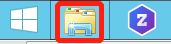

        1.  Go to folder `C:\Users\Administrator\Documents\zowe-trial-scenario-2`, which contains the source code for the sample project.

            

        1. Right-click the folder that is named **part-02-UI** and select **Open with Code** to open the folder in VS Code.

           

    1. Run the sample project in the VS Code terminal.

        1. In VS Code, from the menu bar, click **View** > **Terminal** to open the terminal.

              

           Below the editor region, the terminal panel is started in the current working directory.

           

        1. Change the current working directory to _webClient_ by issuing the following command in the terminal panel and press Enter:
           ```
           cd zlux/sample-trial-app/webClient
           ```
           

        1. Issue the `npm install` command and press Enter to install the sample project. Wait for about one minute for the process to complete.

           

           When complete, you will see messages similar to the following ones. No action is required here.

           

       1. Enter the `npm run build` command to run the build. The build completes within seconds.

          

          A folder that is named _web_ is created in the root directory _sample-trial-app_.

          

1. **Transfer the files from the _web_ folder to the Trial Application folder on the Zowe server.**
   1. Enter the following command:

      ```
      scp -P 2022 -r ../web tstradm@10.149.60.146:/zaas1/zowe/1.0.0/sample-trial-app
      ```

      

   2. Enter the password. The password is **tstradm**.

      The files _icon.png_, _mian.js_, and _main.js.map_ are securely copied to the folder _sample-trial-app_ on the Zowe server.

      

1. **Open and test the Trial Sample application in the Zowe Desktop.**

    1. Start Firefox and enter the following URL to access the Zowe Desktop in the address field.
        ```https://10.149.60.146:8544/ZLUX/plugins/org.zowe.zlux.bootstrap/web/index.html```
    1. Enter the following user name and password to log in.
       - User name: **TSTRADM**
       - Password: **TSTRADM**

       The Zowe Desktop opens.

    1. In the Zowe desktop, click the Start menu and locate the _Trial Sample_ application. Right-click on the **Trial Sample** application and select **Pin to taskbar** for later use.

        
    1. Click to open the **Trial Sample** application from the taskbar.

       In this application, click **Accounts** and you will see that the values of the **Name** column are missing. This is because of some missing values in the configuration file of this application.

       

1. **Add the missing code snippet and redeploy the changes.**
    1. Uncomment the missing code snippet in the _Accountlist.js_ file.
        1. In VS Code Explorer, click **zlux** > **sample-trial-app** > **webClient** > **src** > **Accountlist.js**. This file _Accountlist.js_ contains the missing values.

           

           You will see that the code for the user name details is commented out in command line 77 - 79.
           

        1. Uncomment this code snippet by removing the **/*** and ***/** signs at the beginning and the end. Then, press **Ctrl+S** to save the change.

           

    1. Enter `npm run build` to run the build.
       The folder that is named _web_ is updated in the root directory _sample-trial-app_.
    1. Transfer the updated files from the _web_ folder to the Trial Application folder on the Zowe server.
        1. Enter the following command:
           ```
           scp -P 2022 -r ../web tstradm@10.149.60.146:/zaas1/zowe/1.0.0/sample-trial-app
           ```
        2. Enter the password. The password is **tstradm**.
           The files _icon.png_, _mian.js_, and _main.js.map_ are securely copied to the folder _sample-trial-app_ on the Zowe server.

1. **Verify that the Trial Sample application works correctly now.**
    1. In the Firefox browser, press `F5` to refresh the Zowe Desktop page.
       A pop-up box is opened to ask for your confirmation to leave. Click **Leave Page** to refresh the Zowe Desktop. When prompted for the password to log in to Zowe Desktop, enter **TSTRADM**.

       

    1. In the Zowe Desktop, click to reopen the **Trial Sample** application from the taskbar.
    1. In this application, click **Accounts** and you will see that the values of the **Name** column are displayed.

        

        You can also click on any name to get its detailed information.

        

### Result
Congratulations! You added the missing values to the Trial Sample application, deployed the changes, and verified that this application works correctly.

### Next step

In the next step, You will work on a Zowe CLI plug-in based on the same Node.js API.

## Step 3: Extending Zowe CLI

You will extend an existing Zowe CLI plug-in by introducing the Node.js programmatic API in scenario 1.

<!--Requirements on the client system: -->

### **Procedure**

1. Open the sample CLI plug-in project in VS Code.

    1. Click on the File Explorer icon in the Windows taskbar to open the File Explorer.

       

    1.  Go to folder `C:\Users\Administrator\Documents\zowe-trial-scenario-2` which contains the source code for the sample project.

        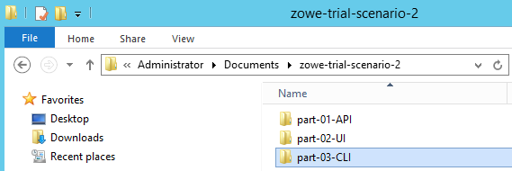

    1. Right click the folder named **part-03-CLI** and select **Open with Code** to open the folder in VS Code.

       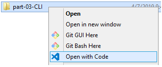

1. Run the sample project in the VS Code terminal.

    1. In VS Code, from the Menu bar, click **View** > **Terminal** to open the terminal.

          

       Below the editor region, the terminal panel is started in the current working directory.

       **Note**: During the whole process, you can always issue `zowe` or `zowe -help` in the terminal panel to view the top-level descriptions.

    1. Change the current working directory to sample-cli-plugin by issuing the following command in the terminal panel and press Enter:
       ```
       cd sample-cli-plugin
       ```
       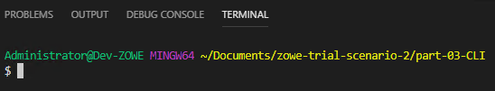
    1. Enter the following command to install the sample CLI plug-in.

        `npm run installPlugin`

        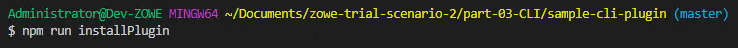
       
       Wait for about 30 seconds for the process to complete. When you see the following command line, the sample CLI plug-in is installed.

        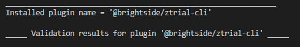

    1. To view all the installed plug-ins, enter the following command and press Enter.
       `zowe plugins list`
       You can see that two plugins are installed, namely, **cics** and **ztrial-cli**. You will use the **ztrial-cli** plugin later.

        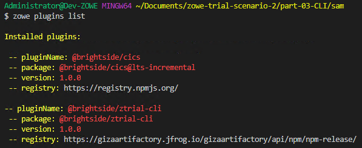

    1. Enter the following command to view all the available options to search in the sample node API that you redeployed in step 1 for information about accounts and cars.

       `zowe zTrialPlugin accounts`

       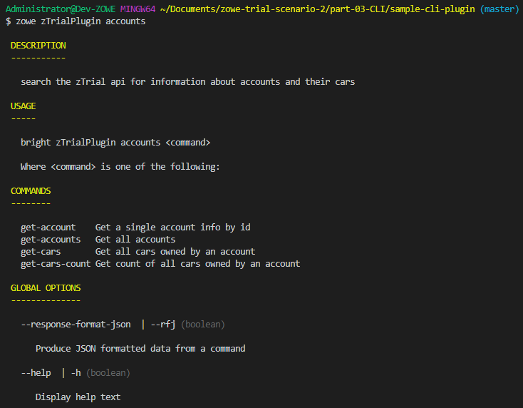

       For example, enter the `zowe zTrialPlugin accounts get-accounts` command to search for the information about all cars; enter the `zowe zTrialPlugin accounts get-account 1` command to search for the information about a single account with id 1.
   1. To get the formation about the cars associated with a single account or all accounts, use `--acountId id or all`.
      1. To get the information about all accounts and their cars, enter the following command.

           `zowe zTrialPlugin accounts get-cars --acountId all`

            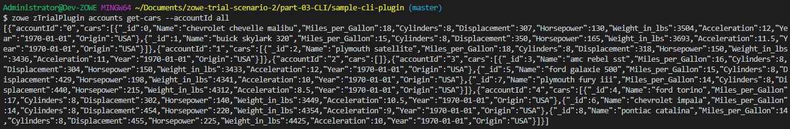

      1.  To get the information about account 3 and its cars, enter the following command.
            
            `zowe zTrialPlugin accounts get-cars --acountId 3`

            

   1. To get the information about the number of the cars associated with all the accounts, enter the following command.
      
      ```
      zowe zTrialPlugin accounts get-cars --acountId all --counts true
      ```

      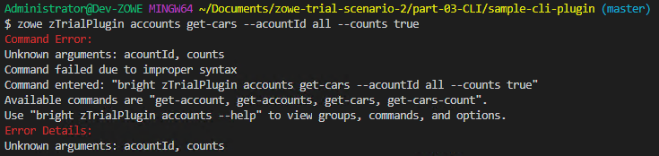

       You can see that this command failed due to improper syntax. Next, let's locate the files to add the code.
1. Add the missing feature into the sample CLI plug-in project.
    1. Open the Explorer tab of VS Code and then click **sample-cli-plugin** > **src** > **cli** > **accounts** > **GetCars**.

       You can find two files, GetCars.definition.ts and GetCars.handler.ts in this directory, which both miss a piece of code snippet.
       
       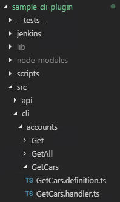

          1. Double-click GetCars.definition.ts to open its contents.

             You will see that, in line 31 - 35, the code for car counting is commented out.

             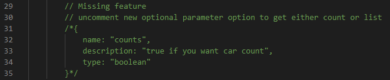

          1. Uncomment this code snippet by removing the /* and */ signs at the beginning and the end. Then, press Ctrl+S to save the change.

              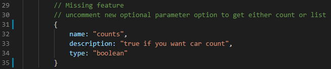

          1. Double-click GetCars.handler.ts to open its contents.

              You will see that, in line 45 - 47, the code for cars counting is commented out.

              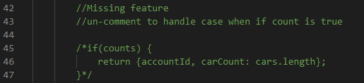

          1. Uncomment this code snippet by removing the /* and */ signs at the beginning and the end. Then, press Ctrl+S to save the change.

               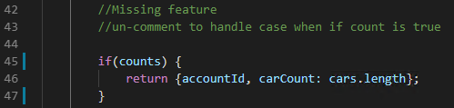
1. Reinstall the sample CLI plug-in by entering the following command.
   
   `npm run installPlugin`

    

   Wait for about 30 seconds for the process to complete. When you see the following command line, the sample CLI plug-in is reinstalled.

    
    
1. Verify that the commands for cars counting works correctly now.

   Back to the terminal panel, enter the following command to view the number of cars associated with all the accounts.
      
   ```
   zowe zTrialPlugin accounts get-cars --acountId all --counts true
   ```

    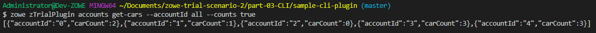

    You can also try to get the information about the number of cars associated with a single account, for example, account 3, by enter the following command:

    ```
    zowe zTrialPlugin accounts get-cars --acountId 3 --counts true
    ```

     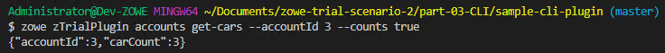

### **Results**  

Congratulations! You added the missing feature of the sample CLI plug-in, redeployed it, and verified that the it works correctly with the sample node API.

# Next Steps
Thanks for your time in exploring the Zowe scenarios!
# Go deeper with Zowe
Zowe is an open source project that is created to host technologies that benefit the Z platform from all members of the Z community, including Integrated Software Vendors, System Integrators, and z/OS consumers.

Zowe, like Mac or Windows, comes with a set of APIs and OS capabilities that applications build on and also includes some applications out of the box.

If you have any interest, visit Zowe (https://zowe.github.io) on Open Mainframe Project to learn more about the capabilities of Zowe and the value it delivers.
