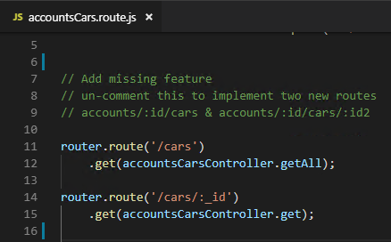

# Scenario 2: Extending Zowe

## Overview 

In this scenario, you will learn how to extend Zowe to add your own API or application. This scenario guides you through the steps in roughly 30 minutes. By the end of the session, you'll know how to:

- Extend the API by adding a REST API to the API Mediation Layer
- Extend Zowe Web UI by creating and deploying an application plug-in on Zowe Desktop
- Extend Zowe CLI by creating a Zowe CLI plug-in to access the API

No previous knowledge of Zowe or API design is needed. Please wait a moment while your development environment loads (this takes a minute or so). When it loads, get started by creating the API project.

## Step 1: Adding a REST API service to the API Mediation Layer

In this step, you will add some missing code to expose an API in API Medidation Layer and then access your API service endpoints to ensure that it works. 

An API will be running in the API Catalog which has some missing features. You will view the current API and then update the code by inserting a code block and then redeploying it. You can then see the new endpoint.

<!--Requirements on the client system: VSCode, npm-->

**Procedure**

1. Visit the Swagger doc. <!--Is it the doc in the API Catalog? How can users access that, by logging in to the API Catalog and click the API Catalog app? Which Swagger doc should users open?-->
1. Open Firefox and enter the following URL in the address field. <!--What's the purpose of doing this? To test if the endpoint works? Users will see that it fails, right?-->
    ```http://localhost:3000/accounts/1/cars```

    The following error message is disaplayed, which indicats that the API is not working.
    

1. Open VSCode from the desktop. <!--How can users open VSCode in the Windows image? That will need to be preinstalled.-->

1. From the VSCode taskbar, select **Terminal** -> **New Terminal**.  The terminal panel will be opened at the bottom of the editor window. 
    
    

1. Enter `npm start`.
1. Enter `npm test`. You will see that one test fails. 
    
    

    This is because there are missing code in the configuration file. Next let's locate the file with missing code, fetch the code and add it to the file.
    
1. Open the Explorer tab of VSCode and then click **SAMPLE-NODE-API** -> **server** -> **routes** -> **accountsCars.route.js**. The content of the **accountsCars.route.js** file is displayed. 

    

    You will see that some code is missing in this file.

    

1. Insert the following code to the file and press Ctrl+S to save the changes.

    ```
    router.route('/cars')
    .get(accountsCarsController.getAll);

    router.route('/cars/:_id')
    .get(accountsCarsController.get);
    ```
    

1. Redeploy the API. <!--How to do it?-->
1. In the TERMINAL window, enter the `npm start` command. 
1. Open Firefox again and enter the following URL in the address field.
    ```http://localhost:3000/accounts/1/cars```

    The API content is displayed, which indicates that you can access the service endpoints.
    

**Next step**


## Step 2: Creating and deploying an application on Zowe Desktop

You will complete a sample application and deploy the application on Zowe Desktop. 

In this step, you will combine some provided code snippets with the skeleton code to build a complete application that displays on the Zowe Desktop.

<!--Requirements on the client system: -->

**Procedure**

1. Define the `pluginDefinition.json` file.
1. Construct a simple Angular UI.
1. Add your app to the desktop.
1.

**Next step**


## Step 3: Extending a Zowe CLI plug-in

You will extend an existing Zowe CLI plug-in by introducing the Node.js programmatic API in scenario 1, and create a command definition with a handler. 

<!--Requirements on the client system: -->

**Procedure**

1. Defining command syntax
1. Defining command handler
1.
1.

**Next step**